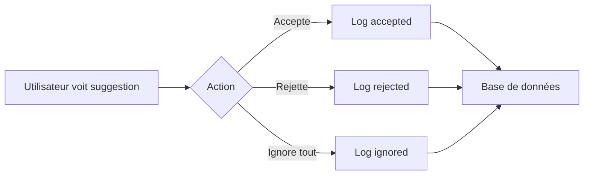
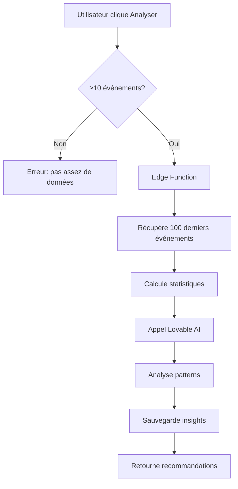
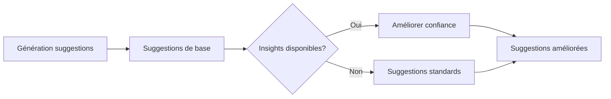

# Système d'Apprentissage Automatique des Suggestions

Ce document explique le fonctionnement du système d'apprentissage automatique qui améliore les suggestions au fil du temps.

## Vue d'ensemble

Le système analyse automatiquement les choix des utilisateurs (suggestions acceptées vs rejetées) pour :
1. **Identifier des patterns** dans les préférences
2. **Ajuster la confiance** des suggestions futures
3. **Générer des recommandations** personnalisées via Lovable AI

## Architecture

### Base de données

**Table `suggestions_events`** : Stocke tous les événements de suggestions
```sql
- id: UUID
- bureau_nom: TEXT (bureau concerné)
- region: TEXT (région)
- field_name: TEXT (nom du champ)
- suggested_value: JSONB (valeur suggérée)
- action: TEXT (accepted, rejected, ignored)
- confidence: TEXT (high, medium, low)
- source: TEXT (bureau_default, similar_cases, frequent_value, ml_improved)
- context_data: JSONB (contexte additionnel)
- created_at: TIMESTAMP
```

**Table `suggestions_insights`** : Stocke les insights générés par l'IA
```sql
- id: UUID
- bureau_nom: TEXT
- field_name: TEXT
- insight_type: TEXT (pattern, preference, recommendation)
- insight_data: JSONB
- confidence_score: NUMERIC (0-1)
- based_on_events_count: INTEGER
- created_at, updated_at: TIMESTAMP
```

### Edge Function

**`supabase/functions/analyze-suggestions/index.ts`** :

Cette fonction utilise **Lovable AI (google/gemini-2.5-flash)** pour :
1. Récupérer les événements récents (100 derniers)
2. Calculer les statistiques (taux d'acceptation, etc.)
3. Analyser les patterns avec l'IA
4. Sauvegarder les insights dans la base de données

**Paramètres d'entrée** :
```typescript
{
  bureauNom: string,
  fieldName: string,
  minEvents: number = 10  // Minimum d'événements requis
}
```

**Réponse** :
```typescript
{
  success: boolean,
  insights: {
    patterns: string[],
    preferences: string[],
    recommendations: string[],
    confidenceScore: number
  },
  eventsAnalyzed: number
}
```

### Services

**`src/services/learningService.ts`** :

1. `logSuggestionEvent(event)` 
   - Enregistre chaque acceptation/rejet de suggestion
   - Appelé automatiquement lors de l'interaction utilisateur

2. `getLearningInsights(bureauNom, fieldName)`
   - Récupère les insights IA pour un champ spécifique
   - Utilisé pour améliorer les suggestions en temps réel

3. `triggerAIAnalysis(bureauNom, fieldName)`
   - Lance l'analyse IA via l'edge function
   - Nécessite minimum 10 événements

4. `getLearningStats(bureauNom?)`
   - Récupère les statistiques globales
   - Calcule les taux d'acceptation par champ

5. `applyLearningToSuggestions(suggestions, bureauNom)`
   - Applique les insights d'apprentissage aux suggestions
   - Améliore la confiance basée sur les patterns appris

### Hook React

**`src/hooks/useSuggestions.ts`** :

Intègre automatiquement l'apprentissage :
```typescript
const {
  suggestions,           // Suggestions améliorées par l'IA
  learningActive,        // État de l'apprentissage
  acceptSuggestion,      // Accepter et logger
  dismissSuggestion,     // Rejeter et logger
  toggleLearning         // Activer/désactiver
} = useSuggestions(partialAffaire);
```

### Interface utilisateur

**`src/components/affaires/LearningMetrics.tsx`** :

Tableau de bord des métriques d'apprentissage :
- Vue globale ou par bureau
- Taux d'acceptation par champ
- Bouton "Analyser avec IA" pour chaque champ
- Indicateurs de performance (vert/jaune/rouge)
- Compteur d'événements nécessaires pour l'analyse

## Flux de fonctionnement

### 1. Tracking automatique



### 2. Analyse IA (déclenchée manuellement)



### 3. Application des insights



## Algorithme d'amélioration

### Ajustement de la confiance

```typescript
// Si insights disponibles avec score > 0.6
if (insights.confidenceScore > 0.6) {
  // Promouvoir low → medium si score > 0.7
  if (suggestion.confidence === 'low' && insights.confidenceScore > 0.7) {
    suggestion.confidence = 'medium';
    suggestion.source = 'ml_improved';
  }
}
```

### Calcul du score de confiance IA

L'IA analyse :
- **Taux d'acceptation global** du champ
- **Cohérence des valeurs** acceptées
- **Patterns temporels** (évolution dans le temps)
- **Contexte du bureau** (similarités avec d'autres bureaux)

Score résultant : `0.0` (aucune confiance) à `1.0` (haute confiance)

## Métriques de performance

### Indicateurs clés

1. **Taux d'acceptation** : `accepted / (accepted + rejected)`
   - ≥ 70% : vert (excellentes suggestions)
   - 40-69% : jaune (suggestions correctes)
   - < 40% : rouge (suggestions à améliorer)

2. **Volume d'événements** : Nombre total d'interactions
   - Minimum 10 pour analyse IA
   - Recommandé 50+ pour insights fiables

3. **Score de confiance IA** : 0-1
   - ≥ 0.8 : Très fiable
   - 0.6-0.79 : Fiable
   - < 0.6 : Peu fiable

### Interprétation

- **Haute acceptation + haute confiance IA** → Suggestions optimales
- **Basse acceptation** → Revoir les règles ou valeurs par défaut
- **Peu d'événements** → Besoin de plus d'utilisation

## Utilisation

### Pour les utilisateurs

1. **Utiliser normalement** : Accepter/rejeter les suggestions
2. **Suivre les métriques** : Dans Paramètres > Rapports
3. **Lancer l'analyse** : Bouton "Analyser avec IA" (après 10+ événements)
4. **Voir les améliorations** : Source "ml_improved" sur les suggestions

### Pour les administrateurs

1. **Configurer valeurs par défaut** : Paramètres > Valeurs défaut
2. **Monitorer l'apprentissage** : Consulter les métriques
3. **Déclencher analyses** : Pour les champs avec beaucoup de rejets
4. **Ajuster configurations** : Basé sur les recommandations IA

## Exemple d'analyse IA

**Input vers l'IA** :
```
Bureau: "Bureau de Dakola"
Champ: "natureInfraction"

Statistiques:
- Total: 45 événements
- Acceptées: 35 (77.8%)
- Rejetées: 10

Valeurs acceptées: ["Exportation sans déclaration", "Fraude documentaire", ...]
Valeurs rejetées: ["Importation irrégulière", ...]
```

**Output de l'IA** :
```json
{
  "patterns": [
    "Les infractions liées à l'exportation sont systématiquement acceptées",
    "Les suggestions d'importation sont souvent rejetées pour ce bureau"
  ],
  "preferences": [
    "Préférence claire pour les infractions d'exportation",
    "Bureau spécialisé dans le contrôle des sorties"
  ],
  "recommendations": [
    "Prioriser les suggestions d'exportation pour ce bureau",
    "Éviter les suggestions d'importation sauf contexte spécifique",
    "Ajouter 'Transit irrégulier' comme valeur par défaut"
  ],
  "confidenceScore": 0.85
}
```

## Sécurité et confidentialité

- Aucune donnée sensible n'est envoyée à l'IA (pas de noms, montants exacts)
- Seules les valeurs de champs et actions sont analysées
- Les insights sont stockés localement dans Supabase
- RLS activé sur toutes les tables

## Performance

### Optimisations

1. **Analyse asynchrone** : L'analyse IA ne bloque pas l'interface
2. **Cache des insights** : Résultats stockés pour réutilisation
3. **Limite des événements** : Max 100 pour l'analyse
4. **Activation optionnelle** : L'apprentissage peut être désactivé

### Coûts

- **Logging** : Gratuit (stockage Supabase)
- **Analyse IA** : Utilise Lovable AI (crédits workspace)
- **Déclenchement** : Manuel → coûts prévisibles

## Évolution future

1. **Analyse automatique périodique** : Cron job quotidien
2. **Suggestions prédictives** : Anticiper les besoins
3. **Apprentissage multi-bureaux** : Partager les insights
4. **Feedback utilisateur** : Noter la qualité des suggestions
5. **A/B testing** : Tester différentes stratégies

## Troubleshooting

### Problème : Pas d'insights générés

- Vérifier que ≥ 10 événements existent
- Vérifier la connexion Lovable AI
- Consulter les logs de l'edge function

### Problème : Faible taux d'acceptation

- Revoir les valeurs par défaut du bureau
- Analyser les valeurs rejetées manuellement
- Ajuster les critères de similarité

### Problème : Suggestions pas améliorées

- Vérifier que l'apprentissage est activé
- Lancer une analyse IA manuelle
- Vérifier le score de confiance des insights
